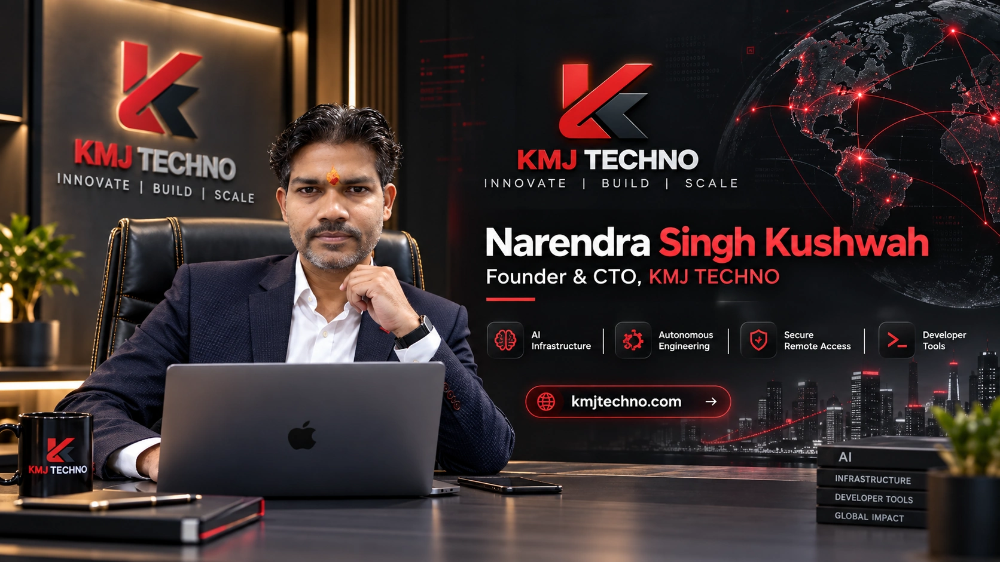
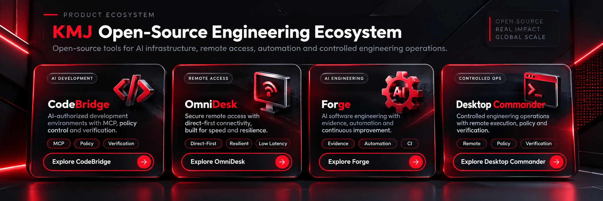

  

<strong>Founder & CTO · KMJ TECHNO</strong> 
Building AI-native infrastructure, autonomous engineering systems, secure remote access and developer platforms.

  <a href="https://kmjtechno.com"><strong>Website</strong></a> ·
  <a href="https://github.com/kmjtechno?tab=repositories"><strong>Repositories</strong></a> ·
  <a href="https://github.com/kmjtechno/kmj-codebridge"><strong>CodeBridge</strong></a> ·
  <a href="https://github.com/kmjtechno/kmj-omnidesk"><strong>OmniDesk</strong></a> ·
  <a href="https://github.com/kmjtechno/kmj-forge"><strong>Forge</strong></a>

---

<table>
<tr>
<td width="36%" align="center" valign="top">

### Narendra Singh Kushwah
**Founder & CTO · KMJ TECHNO**

<strong>Founder & CTO</strong> &nbsp;·&nbsp; <strong>AI Systems</strong> &nbsp;·&nbsp; <strong>Developer Tools</strong>

[**KMJ TECHNO →**](https://kmjtechno.com)

</td>
<td width="64%" valign="top">

## Building the infrastructure for AI-assisted engineering

KMJ TECHNO develops systems that connect AI and engineers to real development environments with **explicit authorization, controlled execution, measurable performance, and verifiable outcomes**.

### Founder focus

**AI-native engineering** — controlled AI access to real projects.

**Autonomous engineering** — inspect → modify → test → verify workflows backed by evidence.

**Secure remote access** — direct-first, resilient connectivity designed for constrained networks.

**Developer infrastructure** — MCP integrations, build systems, CI-backed automation and engineering tools.

**Industrial systems** — calibration, projection, imaging and computer-vision workflows.

</td>
</tr>
</table>

## Open-source engineering ecosystem

  

| Project | Purpose | Explore |
|---|---|---|
| **KMJ CodeBridge** | Secure MCP infrastructure connecting compatible AI clients to explicitly authorized development environments. | [Repository →](https://github.com/kmjtechno/kmj-codebridge) |
| **KMJ OmniDesk** | High-performance secure remote access with a direct-first architecture and low-bandwidth focus. | [Repository →](https://github.com/kmjtechno/kmj-omnidesk) |
| **KMJ Forge** | Evidence-driven, provider-independent software engineering workflows for humans and AI. | [Repository →](https://github.com/kmjtechno/kmj-forge) |
| **KMJ Desktop Commander** | Policy-controlled remote engineering operations with explicit authorization boundaries. | [Repository →](https://github.com/kmjtechno/kmj-desktop-commander) |

## Engineering principles

> **Useful access without uncontrolled access. Automation without unverifiable outcomes.**

- **Security by design** — explicit trust boundaries and scoped authorization.
- **Least privilege** — expose only the project, device and action required.
- **Evidence over assumptions** — engineering actions should finish with verification.
- **Performance by architecture** — remove unnecessary infrastructure from latency-sensitive paths.
- **Resilience** — design for reconnects, unstable networks and partial failures.
- **Open interoperability** — prefer standards where they improve portability.
- **Honest status** — experimental or gated capabilities stay clearly labeled.

## Technology focus

  
  
  
  
  
  
  

**AI · MCP · Rust · Node.js · Python · Linux · Windows · Networking · CI/CD · Computer Vision · Remote Access · Distributed Systems**

## Build with KMJ TECHNO

We welcome reproducible issues, interoperability improvements, security fixes, benchmarks, diagnostics, documentation and focused pull requests.

If a project is useful to you, **⭐ star the repository** and share the engineering evidence that helps make it better.

---

  

<strong>INNOVATE · BUILD · SCALE</strong> 
AI Infrastructure · Autonomous Engineering · Secure Remote Access · Developer Tools  
<a href="https://kmjtechno.com"><strong>kmjtechno.com</strong></a>

