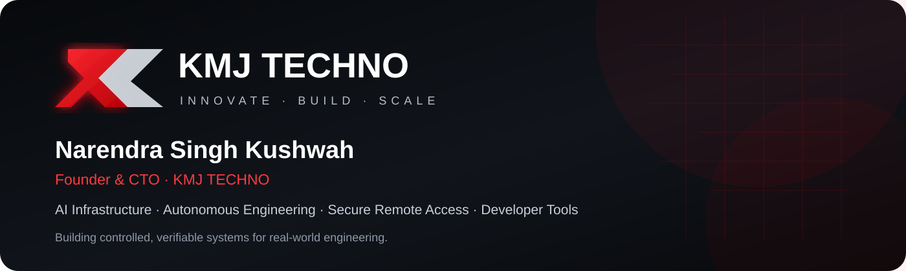
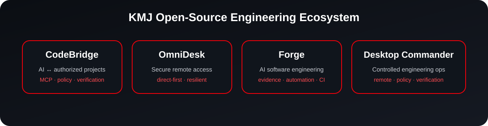

<p align="center">
  
</p>

<p align="center">
  <a href="https://kmjtechno.com"><strong>Website</strong></a> ·
  <a href="https://github.com/kmjtechno?tab=repositories"><strong>Open Source</strong></a> ·
  <a href="https://github.com/kmjtechno/kmj-codebridge"><strong>CodeBridge</strong></a> ·
  <a href="https://github.com/kmjtechno/kmj-omnidesk"><strong>OmniDesk</strong></a>
</p>

# Building AI-native engineering infrastructure

I’m **Narendra Singh Kushwah**, Founder & CTO of **KMJ TECHNO**.

KMJ TECHNO builds software and infrastructure around a simple engineering principle:

> **AI should be able to act on real systems without turning control, authorization, and verification into afterthoughts.**

Our work focuses on secure AI infrastructure, autonomous engineering, developer systems, remote access, cloud software, and industrial-calibration technology.

## What we are building

- **AI infrastructure** that connects compatible AI clients to explicitly authorized development environments.
- **Autonomous engineering systems** designed around inspect → modify → test → verify workflows.
- **Secure remote-access technology** focused on speed, resilience, and controlled connectivity.
- **Developer infrastructure** for real repositories, devices, build systems, and CI-backed engineering.
- **Industrial software** for calibration, mapping, projection, imaging, and advanced technical workflows.

<p align="center">
  
</p>

## Flagship open-source projects

### 🔗 [KMJ CodeBridge](https://github.com/kmjtechno/kmj-codebridge)

**Secure AI infrastructure for authorized development environments.**

CodeBridge connects ChatGPT, Claude, and compatible MCP clients to authorized projects across laptops, workstations, and VPS environments through scoped access, policy-controlled actions, and verifiable engineering workflows.

**Core ideas:** vendor-neutral MCP · outbound device agents · guarded writes · administrator-approved quality gates · tenant-aware authorization.

[Explore CodeBridge →](https://github.com/kmjtechno/kmj-codebridge)

---

### 🖥️ [KMJ OmniDesk](https://github.com/kmjtechno/kmj-omnidesk)

**High-performance secure remote access.**

OmniDesk is being engineered around a direct-first architecture with emphasis on low-latency control, constrained-network performance, NAT traversal, reconnect resilience, and measurable trust boundaries.

[Explore OmniDesk →](https://github.com/kmjtechno/kmj-omnidesk)

---

### ⚙️ [KMJ Forge](https://github.com/kmjtechno/kmj-forge)

**Evidence-driven software engineering for humans and AI.**

Forge focuses on reproducible, provider-independent and automation-friendly engineering workflows with CI-backed evidence.

[Explore Forge →](https://github.com/kmjtechno/kmj-forge)

---

### 🛡️ [KMJ Desktop Commander](https://github.com/kmjtechno/kmj-desktop-commander)

**Policy-controlled engineering operations.**

Desktop Commander focuses on controlled remote and desktop engineering actions with explicit authorization and verification boundaries.

[Explore Desktop Commander →](https://github.com/kmjtechno/kmj-desktop-commander)

## Engineering philosophy

```text
Human / AI Client
        │
        ▼
Identity + Authorization
        │
        ▼
Policy-Controlled Tools
        │
        ▼
Approved Project / Device
        │
        ▼
Inspect → Modify → Test → Verify
        │
        ▼
Evidence-backed Result
```

We optimize for:

- **Security by design** — explicit boundaries instead of broad implicit trust.
- **Least privilege** — expose only the project, device, action, and execution scope required.
- **Verification** — engineering actions should end with evidence, not assumptions.
- **Performance** — avoid unnecessary infrastructure in latency-sensitive paths.
- **Resilience** — design for unstable networks, reconnects, partial failures, and real-world conditions.
- **Open standards** — use interoperable protocols where they improve portability.
- **Honest status reporting** — experimental or gated capabilities should be labeled as such.
- **Minimal unnecessary dependencies** — keep core systems understandable, maintainable, and controllable.

## Technology focus

<p>
  
  
  
  
  
  
  
</p>

**AI · MCP · Rust · Node.js · Python · Linux · Windows · Networking · CI/CD · Computer Vision · Remote Access · Distributed Systems · Enterprise Software**

## Open-source direction

We publish engineering work that can be inspected, tested, reproduced, and improved.

Good contributions include:

- security and authorization improvements;
- MCP interoperability;
- cross-platform fixes;
- deterministic tests;
- performance and reliability evidence;
- safer editing and execution primitives;
- diagnostics;
- documentation and onboarding improvements.

If a project solves a real problem for you, **⭐ star the repository**. A reproducible issue, integration note, benchmark, test case, or focused pull request is even more valuable.

## For developers, teams, and partners

KMJ TECHNO is building toward an ecosystem where AI systems can securely interact with development machines, VPS infrastructure, engineering projects, remote systems, and build pipelines—while maintaining explicit control over identity, permissions, execution, licensing, and verification.

For product information and company updates, visit **[kmjtechno.com](https://kmjtechno.com)**.

---

<div align="center">

### KMJ TECHNO

**Innovate · Build · Scale**

Building controlled, high-performance systems for the next generation of AI-assisted engineering.

**Narendra Singh Kushwah · Founder & CTO**

[Website](https://kmjtechno.com) · [Repositories](https://github.com/kmjtechno?tab=repositories)

</div>

<!--
Discoverability: KMJ TECHNO, Narendra Singh Kushwah, AI infrastructure, MCP, autonomous engineering,
developer tools, secure remote access, remote desktop, Rust, Node.js, Python, cloud infrastructure,
CI/CD, enterprise software, computer vision, industrial calibration, open source.
-->
